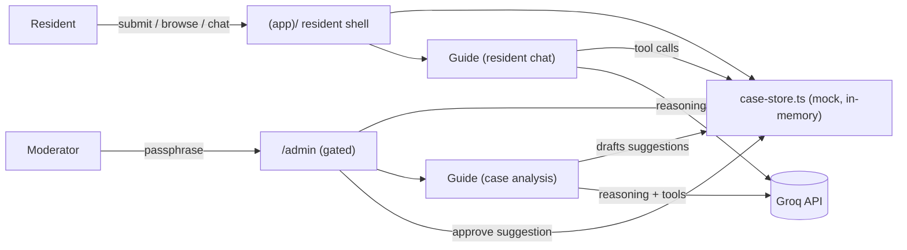

# CommonGround

An independent, multilingual, privacy-preserving civic-action platform. CommonGround helps a
community turn scattered local observations (flooding, garbage, damaged infrastructure) into
organized, verified information and trackable collective action — never a replacement for
official emergency services, and never a guarantee that a problem will be solved.

> "CommonGround es un proyecto independiente de tecnología comunitaria. No representa a ningún
> gobierno, municipio, servicio de emergencia ni institución pública."

## Live pilot community

**Santiago de Veraguas, Panamá** (Spanish-first, English available). A second, wholly fictional
community (**Riverbend**) exists only to prove the platform's `CommunityConfig` schema
generalizes to a different country/language/category set — it is always visibly labeled as
demonstration data.

## Features

- **Guided report/proposal flow** — a 5-step wizard (type → category → description/photo →
  privacy-preserving area → review + consent). Never asks for a name, phone number, or exact
  address; photos are validated (type/size) and only their metadata is ever kept, never the
  image itself.
- **Public case tracking** — every submission gets a public case number
  (`SV-2026-0001`-style, scoped per community per year), a real status history, and a visual
  "Observed → Organized → Reviewed → Connected → Updated" progress trail that only ever shows
  stages that actually happened.
- **Resident self-service** — anyone can flag a case as inaccurate for moderator review; a
  submitter can delete their own case via a one-time management link (there are no accounts at
  all, so this link is the only proof of ownership).
- **Activity dashboard** — a list view (default) plus an optional abstract 3D "Community
  Pulse" visualization (React Three Fiber) that never implies a neighborhood is more dangerous
  or that more reports mean greater urgency, with a full list/keyboard/reduced-motion fallback.
- **Admin moderation** — a passphrase-gated local prototype (`/admin`) for status changes,
  verification marking, duplicate marking, private notes, and reviewing the public
  inaccuracy-flag queue. Every action is recorded and attributed.
- **CommonGround Guide** — an agentic assistant (Groq) with two surfaces: a resident-facing
  chat that can look up similar cases and explain the process, and an admin case-analysis agent
  that uses tools to reason about likely duplicates/status/verification and drafts suggestions
  — a moderator always has to click Approve before anything actually changes.

## Stack

Next.js 16 (App Router, Turbopack) · TypeScript · Tailwind CSS v4 · Zod (every data shape is a
runtime-validated schema, the single source of truth) · Vitest · React Three Fiber/`three` ·
Groq (`groq-sdk`) for the Guide's real reasoning.

**Persistence (prototype phase):** an in-memory mock store (`src/lib/store/case-store.ts`,
`globalThis`-backed so it survives dev-mode hot reload), not a real database yet — a documented
later swap, per `docs/ARCHITECTURE.md`.

## Architecture notes



- `src/lib/schema/` — every `Report`/`Proposal`/`CommunityConfig` shape as a Zod schema.
  `PublicCase` (a structural `Omit` of every private field) is what any resident-facing code
  path is allowed to touch — private notes, moderation history, and Guide suggestions can't
  reach a public page even by accident, enforced at the type level, not just by convention.
- `src/app/(app)/` — the resident-facing shell (sidebar/bottom-nav/footer). `src/app/admin/`
  is a sibling of that route group, not nested inside it, so it never inherits that shell.
- `src/lib/guide/` — the Guide's tools (read-only, public-fields-only), the resident chat, and
  the bounded admin case-analysis loop. The Guide never mutates a case directly; approving one
  of its suggestions calls the exact same functions the manual moderation panel buttons do.
- Full behavioral/privacy/moderation rules live in `docs/` (`PRIVACY.md`, `MODERATION.md`,
  `ARCHITECTURE.md`, `DESIGN_SYSTEM.md`, `3D_EXPERIENCE.md`) — read those before changing
  anything safety- or privacy-adjacent.

## Local setup

```bash
npm install
cp .env.example .env.local   # fill in ADMIN_ACCESS_CODE / GROQ_API_KEY if you need /admin or the Guide
npm run dev
```

Neither env var is required for the resident-facing app to run — `/admin` shows a login form
regardless, and the Guide degrades to "not available right now" rather than erroring.

## Commands

```bash
npm run dev          # start the dev server
npm run build        # production build
npm run lint         # eslint
npx tsc --noEmit     # typecheck
npm test             # vitest, single run
```

All four (`build`, `lint`, `tsc --noEmit`, `test`) must be clean before any commit that touches
`src/` — enforced in CI on every push/PR (`.github/workflows/ci.yml`).

## License

MIT — see [`LICENSE`](LICENSE).

## What I learned

See [`DEVLOG.md`](DEVLOG.md) for the real bugs hit while building this — the two most
significant: a private-moderator-notes leak into every public case page's own data (caught in
a deliberate final review pass, not by a user report), and this repo's stricter
`react-hooks/set-state-in-effect` lint rule, which repeatedly rejected the "obvious"
localStorage/browser-API read-on-mount pattern in favor of `useSyncExternalStore`.
